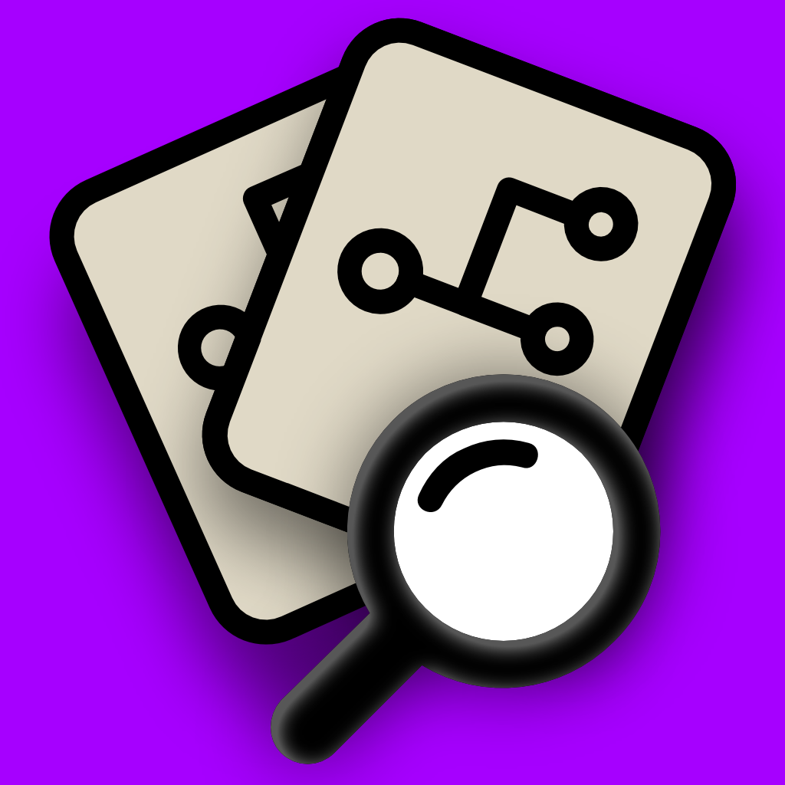
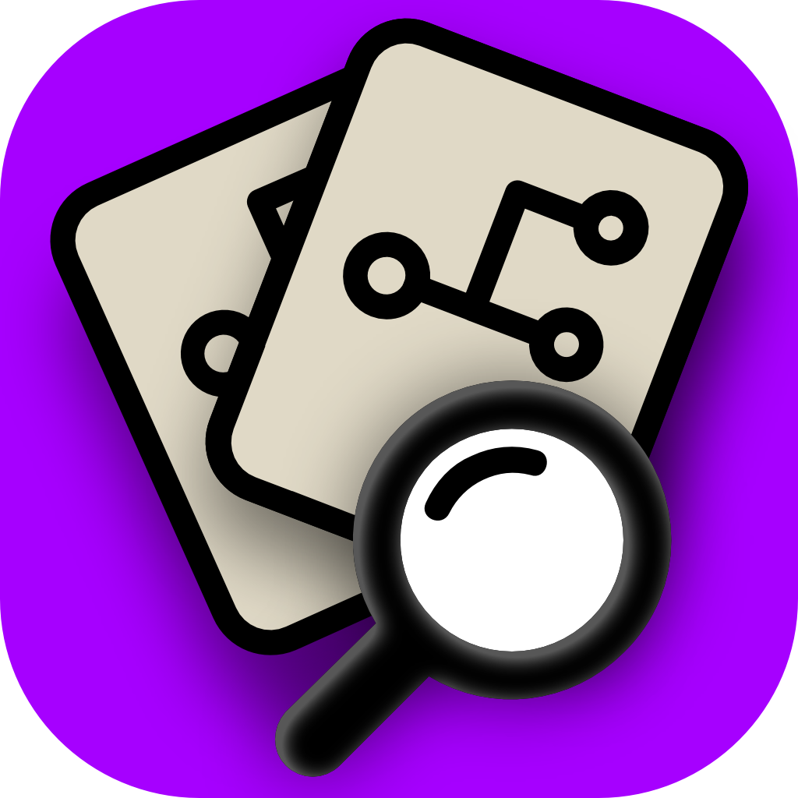

# Press Kit
---

## App Icon

## Description

PR Focus makes it easy to watch important pull requests across repositories that matter to you, and ignore the pull requests you don't care about. It's a self-updating PR dashboard that makes it easy to spot pull requests with updates that may need your attention.

### Watch repositories in one place

Watch incoming pull requests across multiple repositories - all in one place.

* See PRs that are opened in repositories you're watching, and choose whether to **Watch** or **Ignore** them.
* View the default *All Pull Requests* dashboard for a summary view of everything in one place.
* Drill down into individual *Repository Dashboards* to focus in on the work in a specific repository.
* Watch individual pull requests if you don't want to see everything that comes through a repository.

### Track PR progress

Find out about updates to pull requests - without having to leave the app.

* PRs with updates change color to let you know there's something new.
* PR workflow *Checks*, *Commits*, *Comments*, or *Reviews* are bolded when there are updates so you can quickly scan what's new.
* Click into a pull request to view all the relevant PR details without leaving the app. Changes since you last viewed the details have a **New** label.
* Every workflow *Check*, *Commit*, *Comment*, or *Review* has a link to go directly to the element in GitHub. Easily view failed pull request checks, see what's new in a commit, or reply to important comments.
* PRs that haven't been updated for a while automatically move out of your main dashboard to a special *Inactive PRs* dashboard. They get out of the way of your everyday work, but go to a dedicated dashboard so you don't forget about them.
* PRs that are closed automatically move to the *Archived PRs* dashboard. They disappear from your main dashboard when they're no longer relevant, but you can always view the details again in their dedicated dashboard.

## App Details

    <table>
    <tr>
        <th>App Name</th>
        <td>PR Focus</td>
    </tr>
    <tr>
        <th>Price</th>
        <td>Free 30-day trial with full functionality. One-time purchase to continue using the app forever: $24.99 USD.</td>
    </tr>
    <tr>
        <th>Platforms</th>
        <td>macOS</td>
    </tr>
    <tr>
        <th>App ID</th>
        <td>6449602269</td>
    </tr>
    <tr>
        <th>App Store Link</th>
        <td>TBD</td>
    </tr>
    <tr>
        <th>Release Date</th>
        <td>TBD</td>
    </tr>
    <tr>
        <th>Mastodon</th>
        <td>@prfocus@corporaterunaways.social</td>
    </tr>
    <tr>
        <th>Email</th>
        <td><a href="mailto:info@prfocus.app">info@prfocus.app</a></td>
    </tr>
    <tr>
        <th>Website</th>
        <td>http://prfocus.app</td>
    </tr>
    <tr>
        <th>Developer</th>
        <td>Dachary Carey</td>
    </tr>
    </table>

## Screenshots

## Hero Images

## Video

### Watch and Ignore Incoming PRs

<iframe width="500" height="315" src="https://www.youtube.com/embed/2XtVEt5QWzk?si=z9KWfrRTyJSCQdKQ" title="YouTube video player" frameborder="0" allow="accelerometer; autoplay; clipboard-write; encrypted-media; gyroscope; picture-in-picture; web-share" referrerpolicy="strict-origin-when-cross-origin" allowfullscreen></iframe>

### See What's New in Your PRs

<iframe width="500" height="315" src="https://www.youtube.com/embed/2vGIhrUi06g?si=lmyoQE3G2p21IFtL" title="YouTube video player" frameborder="0" allow="accelerometer; autoplay; clipboard-write; encrypted-media; gyroscope; picture-in-picture; web-share" referrerpolicy="strict-origin-when-cross-origin" allowfullscreen></iframe>

### Watch Repos and PRs You Care About

<iframe width="500" height="315" src="https://www.youtube.com/embed/FqqggAxbKlw?si=R1tdPieY-tPFaYfz" title="YouTube video player" frameborder="0" allow="accelerometer; autoplay; clipboard-write; encrypted-media; gyroscope; picture-in-picture; web-share" referrerpolicy="strict-origin-when-cross-origin" allowfullscreen></iframe>

## About the Developer

[Dachary Carey](https://dacharycarey.com) is a technical writer who works on Developer Documentation by day, and writes apps by necessity. PR Focus was born out of a desire to track the product source of truth - the code - instead of relying on Jira tickets and Google documents that may not reflect the state of reality. Before PR Focus, Dachary wrote an iOS RPG playthrough tracker app called [Shattered Ring](https://shatteredring.com) to compensate for the lack of a quest tracker in Elden Ring. More apps are in the works...
